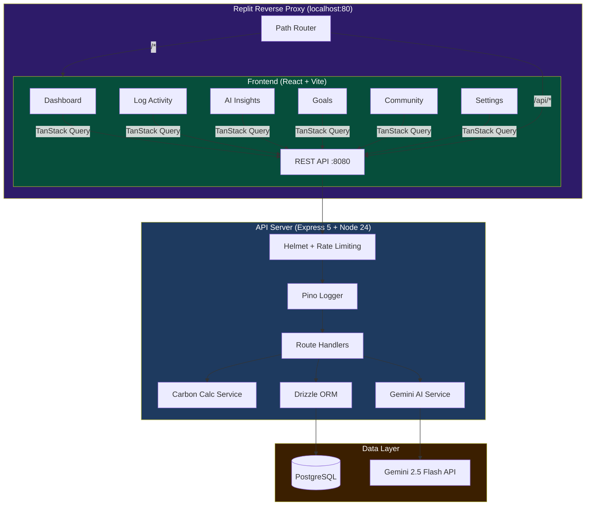
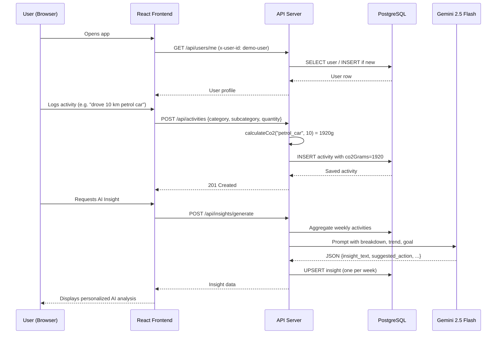
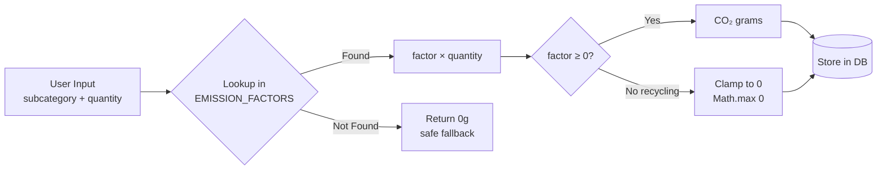
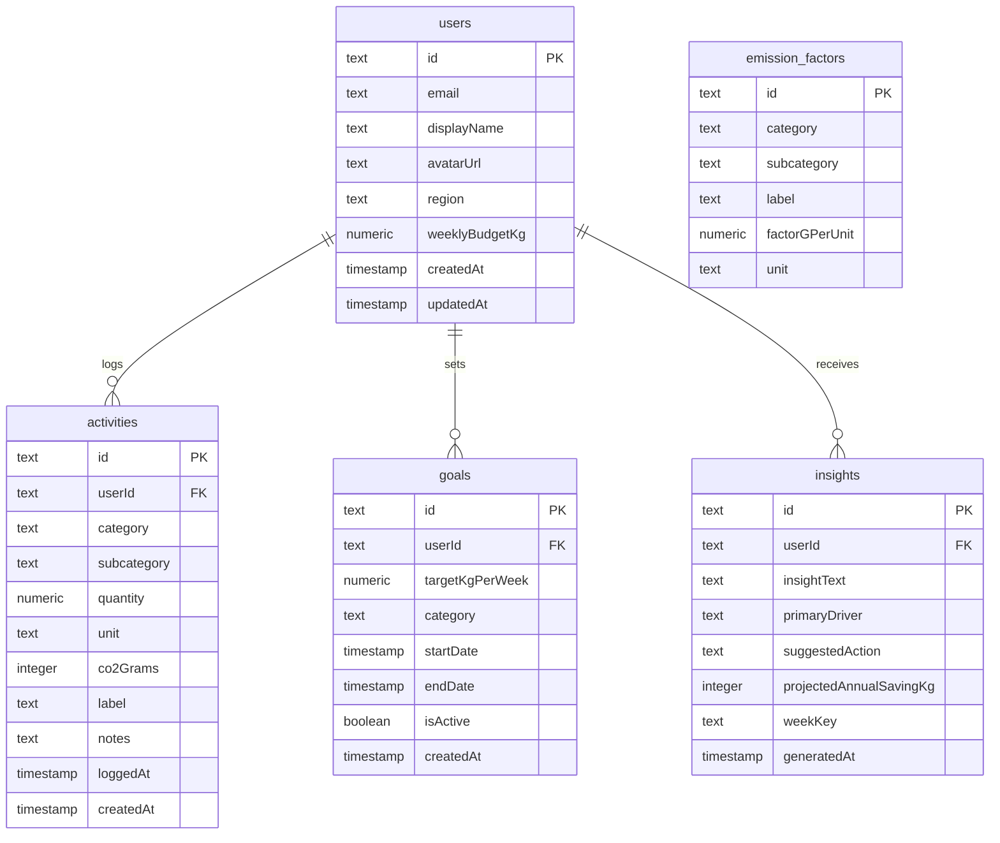

# CarbonPulse 🌍

> **Precision carbon intelligence platform** — log daily activities, get IPCC AR6-accurate CO₂ calculations, AI-powered weekly insights via Gemini 2.5 Flash, and community benchmarking.

---

## Table of Contents

- [Problem Statement](#problem-statement)
- [Architecture](#architecture)
- [Data Flow](#data-flow)
- [Tech Stack](#tech-stack)
- [Features](#features)
- [Emission Factors](#emission-factors)
- [API Reference](#api-reference)
- [Project Structure](#project-structure)
- [Getting Started](#getting-started)
- [Testing](#testing)
- [Security](#security)
- [Accessibility](#accessibility)
- [Environment Variables](#environment-variables)

---

## Problem Statement

Individuals generate roughly **4–10 tonnes of CO₂e per year** but have almost no visibility into where those emissions come from or how to meaningfully reduce them. Existing carbon calculators are either:
- Too generic (annual estimates with no daily resolution)
- Too complex for non-experts
- Disconnected from IPCC-validated science

**CarbonPulse** solves this by combining:
1. **Precision logging** — subcategory-level activity tracking (e.g. *beef* vs *chicken*, *petrol car* vs *metro rail*)
2. **IPCC AR6 emission factors** — sourced from the 2023 Working Group III report with India/Rajasthan regional grid data
3. **AI intelligence** — Gemini 2.5 Flash generates personalized weekly insights with concrete, quantified actions
4. **Community benchmarking** — user percentile vs regional and global averages

---

## Architecture



---

## Data Flow



---

## Carbon Calculation Flow



---

## Tech Stack

| Layer | Technology |
|---|---|
| **Frontend** | React 19, Vite 7, TypeScript 5.9 |
| **Routing** | Wouter (lightweight, 3KB) |
| **State / Data** | TanStack React Query v5 |
| **UI Components** | shadcn/ui, Tailwind CSS v4 |
| **Charts** | Recharts |
| **Animations** | Framer Motion |
| **API Server** | Express 5, Node.js 24 |
| **ORM** | Drizzle ORM |
| **Database** | PostgreSQL |
| **Validation** | Zod v4 (server + client) |
| **API Contract** | OpenAPI 3.1 → Orval codegen |
| **AI** | Gemini 2.5 Flash (Google AI) |
| **Logging** | Pino + pino-http |
| **Security** | Helmet, express-rate-limit |
| **Testing** | Vitest 4, Supertest |
| **Package Manager** | pnpm workspaces |

---

## Features

### Dashboard — Mission Control
- **Live pulse metrics**: Today / Week CO₂ in kg with trend arrows
- **Budget progress bar**: Week emissions vs personal weekly target
- **30-day area chart**: Daily CO₂ trend with Recharts
- **Category donut chart**: Transport / Food / Energy / Shopping / Waste breakdown
- **Activity streak**: Consecutive days logged
- **Recent activities feed**: Last 5 logged items

### Log Activity
- 5 categories with subcategory picker
- **Transport route preview**: Enter origin + destination → compare CO₂ for car vs metro vs bike using Haversine distance calculation
- Real-time CO₂ estimate before saving

### AI Insights (Gemini 2.5 Flash)
- One insight per week (upserts if regenerated)
- Personalized based on actual emission breakdown, trend vs last week, and weekly goal
- Outputs: insight narrative, primary driver, concrete action, projected annual saving in kg
- Graceful fallback to curated insights if API unavailable

### Goals
- Set weekly CO₂ target (kg/week)
- Progress bar tracking with on-track/over-budget status
- Category-level goal support

### Community
- User percentile ranking vs regional and global averages
- Category-by-category comparison bars

### Settings
- Display name editor
- Weekly budget slider (10–200 kg)
- Theme toggle: Light / Dark / System

---

## Emission Factors

All factors sourced from **IPCC AR6 Working Group III (2023)** with India-specific grid data.

### Transport (gCO₂e per passenger-km)

| Mode | Factor (g/km) |
|---|---|
| Domestic Flight | 255 |
| Petrol Car | 192 |
| International Flight | 195 |
| Motorcycle | 103 |
| Bus | 89 |
| Metro / Rail | 41 |
| Bicycle / Walking | 0 |

### Food (gCO₂e per kg)

| Item | Factor (g/kg) |
|---|---|
| Beef | 99,500 |
| Lamb / Mutton | 39,200 |
| Pork | 12,100 |
| Chicken | 9,870 |
| Eggs | 4,500 |
| Rice (Indian paddy) | 4,450 |
| Fish (wild-caught) | 5,100 |
| Dairy / Milk | 3,200 |
| Legumes / Pulses | 2,000 |
| Vegetables (local) | 980 |

### Energy

| Source | Factor | Unit |
|---|---|---|
| Electricity (Rajasthan) | 890 g | per kWh |
| Electricity (India avg) | 820 g | per kWh |
| LPG Cylinder (14.2 kg) | 44,100 g | per cylinder |
| Piped Natural Gas | 2,204 g | per m³ |

---

## API Reference

Base URL: `/api`

### Authentication
No auth — demo mode. All requests use `x-user-id` header (defaults to `demo-user`).

```
x-user-id: demo-user
```

### Users

| Method | Path | Description |
|---|---|---|
| `GET` | `/users/me` | Get or auto-create user profile |
| `POST` | `/users/me` | Upsert user profile |
| `PATCH` | `/users/me` | Update display name, budget, region |

### Activities

| Method | Path | Description |
|---|---|---|
| `GET` | `/activities` | List activities (paginated) |
| `POST` | `/activities` | Log new activity → auto-calculates CO₂ |
| `GET` | `/activities/summary` | Today/week/month totals + breakdown |
| `GET` | `/activities/trend` | 30-day daily CO₂ series |
| `GET` | `/activities/heatmap` | 90-day heatmap data |
| `GET` | `/activities/streak` | Consecutive logging streak |
| `GET` | `/activities/transport/preview` | Compare transport modes for a route |
| `PATCH` | `/activities/:id` | Edit an activity |
| `DELETE` | `/activities/:id` | Delete an activity |

**POST /activities body:**
```json
{
  "category": "TRANSPORT",
  "subcategory": "petrol_car",
  "quantity": 10,
  "unit": "km",
  "label": "Daily commute"
}
```

### Goals

| Method | Path | Description |
|---|---|---|
| `GET` | `/goals` | List all goals |
| `POST` | `/goals` | Create goal (deactivates previous) |
| `GET` | `/goals/progress` | Current week progress vs active goal |
| `PATCH` | `/goals/:id` | Update target or status |
| `DELETE` | `/goals/:id` | Delete goal |

### AI Insights

| Method | Path | Description |
|---|---|---|
| `GET` | `/insights/latest` | Get this week's insight (404 if none yet) |
| `POST` | `/insights/generate` | Generate/regenerate weekly insight |

### Community & Other

| Method | Path | Description |
|---|---|---|
| `GET` | `/community/stats` | User percentile vs regional/global |
| `GET` | `/emission-factors` | All emission factors by category |
| `GET` | `/healthz` | Health check + uptime |

---

## Database Schema



---

## Project Structure

```
carbonpulse/
├── artifacts/
│   ├── api-server/          # Express 5 backend
│   │   ├── src/
│   │   │   ├── app.ts       # Express app (helmet, rate-limit, cors)
│   │   │   ├── index.ts     # Server entry point
│   │   │   ├── routes/      # Route handlers per resource
│   │   │   ├── services/
│   │   │   │   ├── carbonCalc.service.ts  # IPCC AR6 factors + calculation
│   │   │   │   └── gemini.service.ts      # Gemini 2.5 Flash integration
│   │   │   ├── middleware/
│   │   │   │   └── validate.ts  # Zod validation middleware
│   │   │   └── lib/
│   │   │       ├── logger.ts    # Pino singleton
│   │   │       └── ids.ts       # nanoid-based ID generation
│   │   └── tests/
│   │       ├── setup.ts
│   │       ├── unit/
│   │       │   ├── carbon.service.test.ts   # 25 unit tests
│   │       │   ├── validate.middleware.test.ts
│   │       │   └── gemini.service.test.ts
│   │       └── integration/
│   │           ├── health.test.ts
│   │           ├── users.test.ts
│   │           ├── activities.test.ts
│   │           ├── goals.test.ts
│   │           └── insights.test.ts
│   └── carbonpulse/         # React + Vite frontend
│       └── src/
│           ├── pages/       # Dashboard, Log, Insights, Goals, Community, Settings
│           ├── components/  # Layout, ActivityLogForm, ThemeProvider, shadcn/ui
│           └── App.tsx      # Wouter router
├── lib/
│   ├── api-spec/            # OpenAPI 3.1 source of truth → Orval codegen
│   ├── api-client-react/    # Generated TanStack Query hooks
│   ├── api-zod/             # Generated Zod schemas
│   └── db/                  # Drizzle ORM schema + client
└── pnpm-workspace.yaml      # Monorepo catalog + workspace config
```

---

## Getting Started

### Prerequisites

- Node.js 24+
- pnpm 10+
- PostgreSQL (or use Replit's built-in database)

### Setup

```bash
# Install dependencies
pnpm install

# Set environment variables
# DATABASE_URL=postgresql://...
# GEMINI_API_KEY=your-key-here

# Push database schema
pnpm --filter @workspace/db run push

# Start the API server (port 8080)
pnpm --filter @workspace/api-server run dev

# Start the frontend (separate terminal)
pnpm --filter @workspace/carbonpulse run dev
```

### Regenerate API types (after OpenAPI changes)

```bash
pnpm --filter @workspace/api-spec run codegen
```

---

## Testing

Tests are located in `artifacts/api-server/tests/` using **Vitest 4**.

```bash
# Run all tests
pnpm --filter @workspace/api-server run test

# Watch mode
pnpm --filter @workspace/api-server run test:watch

# Generate coverage report
pnpm --filter @workspace/api-server run test:coverage
```

### Test Suite Overview

| Suite | Type | Tests | Coverage |
|---|---|---|---|
| `carbon.service.test.ts` | Unit | 15 | calculateCo2, haversineDistanceKm, getTransportPreview |
| `validate.middleware.test.ts` | Unit | 10 | body/query/params validation, Express 5 guard |
| `gemini.service.test.ts` | Unit | 9 | API success, fallbacks, network errors |
| `health.test.ts` | Integration | 6 | /healthz, security headers, CORS, 404 |
| `users.test.ts` | Integration | 9 | GET/POST/PATCH /users/me, auto-create |
| `activities.test.ts` | Integration | 10 | Full CRUD, CO₂ calculation, summary |
| `goals.test.ts` | Integration | 10 | Full CRUD, progress, deactivation logic |
| `insights.test.ts` | Integration | 6 | Generate + retrieve, user isolation |

---

## Security

| Control | Implementation |
|---|---|
| **Security Headers** | Helmet (X-Content-Type-Options, X-Frame-Options, Referrer-Policy, etc.) |
| **Rate Limiting** | 300 req/15 min general; 5 req/min for AI insight generation |
| **Input Validation** | Zod v4 schemas on every route (body, params, query) |
| **CORS** | Configured with explicit allowed methods and headers |
| **Body Size Limit** | 1 MB cap on JSON + urlencoded requests |
| **No Auth Secrets** | Demo mode — no passwords, tokens, or session data stored |
| **Structured Logging** | Pino (no sensitive data in log serializers) |

---

## Accessibility

| Feature | Implementation |
|---|---|
| **Skip to content** | `Skip to main content` link (visible on keyboard focus) |
| **Landmark roles** | `<nav role="navigation">`, `<main>`, `<aside>` with `aria-label` |
| **Active page** | `aria-current="page"` on active nav links |
| **Icon buttons** | `aria-hidden="true"` on decorative icons |
| **Mobile nav** | `aria-label` on icon-only items |
| **Semantic HTML** | Proper heading hierarchy, button vs div |

---

## Environment Variables

| Variable | Required | Description |
|---|---|---|
| `DATABASE_URL` | ✅ | PostgreSQL connection string |
| `GEMINI_API_KEY` | ⚠️ Optional | Gemini 2.5 Flash API key — falls back to curated insights |
| `PORT` | Auto | Server port (set by workflow, default 8080) |
| `NODE_ENV` | Auto | `development` or `production` |

---

## Google Services Integration

CarbonPulse integrates with **Google's Gemini 2.5 Flash** model via the Google AI API:

- **Model**: `gemini-2.5-flash` — state-of-the-art reasoning with fast inference
- **Use case**: Weekly personalized carbon insight generation
- **Prompt engineering**: Structured prompt with actual user data (emission breakdown, week-over-week trend, goal status)
- **Response format**: `responseMimeType: "application/json"` for reliable structured output
- **Rate protection**: 5 requests/minute limit on the generate endpoint
- **Resilience**: Full fallback to curated, category-matched insights if API unavailable or key missing

---

## License

MIT — build on this, fork it, reduce your footprint. 🌱
